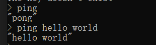
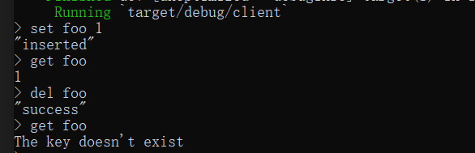
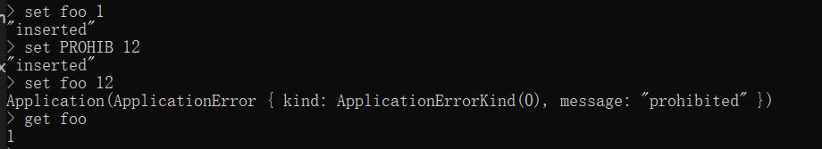

# mini-redis

### ping
* usage:

`ping [string]`

* example



### set get del

* usage

```
set [key] [value]
get [key]
del [key]
```
here value is an integer
* example


### filter

* usage

`set PROHIB [value]`

Then you can not set any varible to the value specified

* example



